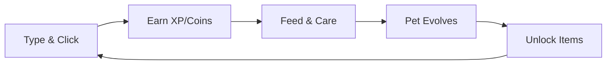

# 🐾 Meowchi - Your Productivity Pet

<div align="center">
  
  
  
  [](https://github.com/developtheweb/meowchi-releases/releases)
  [](https://github.com/developtheweb/meowchi-releases/releases/latest)
  [](https://github.com/developtheweb/meowchi-releases/releases)
  
  **Transform your productivity into pet care! 🎮**
  
  *A desktop companion that thrives on your keyboard & mouse activity*

</div>

---

## 🎯 Quick Download

<table>
  <tr>
    <td align="center">
      <h3>🪟 Windows</h3>
      <a href="https://github.com/developtheweb/meowchi-releases/releases/latest/download/Meowchi-Setup.exe">
        
      </a>
      <br><sub>Windows 10/11</sub>
    </td>
    <td align="center">
      <h3>🍎 macOS</h3>
      <a href="https://github.com/developtheweb/meowchi-releases/releases/latest/download/Meowchi.dmg">
        
      </a>
      <br><sub>macOS 10.13+</sub>
    </td>
    <td align="center">
      <h3>🐧 Linux</h3>
      <a href="https://github.com/developtheweb/meowchi-releases/releases/latest/download/Meowchi.AppImage">
        
      </a>
      <br><sub>Ubuntu 18.04+</sub>
    </td>
  </tr>
</table>

---

## ✨ Features at a Glance

### 🎯 NEW in v0.5.0: Viral Features
- **Personality System** - 5 unique personalities affecting gameplay
- **Streak Rewards** - Daily login, care, and activity streaks  
- **Seasonal Events** - Limited-time themes with exclusive items
- **Share Cards** - Generate and share your pet's stats
- **Custom Help Menu** - Complete credits and keyboard shortcuts

### 🎮 Core Gameplay
- **Virtual Pet System** - Feed, clean, and play with your digital cat
- **Activity Tracking** - Earn XP through real keyboard/mouse usage
- **Always-On-Top** - Draggable floating companion on your desktop

### 🎨 Customization
- **15 Animated Characters** - Each with 9 unique animation states
- **25 Collectible Hats** - From common to legendary rarities
- **Emoji or Sprite Mode** - Choose your visual style

### 🌀 Chaos Mode
Inspired by Desktop Goose - Let Meowchi demand your attention!
- **Mild** 😊 - Occasional movements and jumps
- **Moderate** 😈 - Chase mouse, play dead, throw things  
- **Extreme** 🔥 - Maximum chaos with window shaking

### 🦋 Evolution System
Watch Meowchi transform based on your care:
```
Basic → Angel/Sleepy/Goblin → Guardian/Zen/Overlord → Celestial
```

### 💰 Economy & Progression
- Earn **coins** through activity (1 per 100 actions)
- Complete **17 achievements** across 6 categories
- Use **Pomodoro timer** for 25-coin focus bonuses
- Shop for food, toys, and premium items

---

## 🎯 How It Works



1. **Work Normally** - Meowchi tracks your productivity
2. **Earn Rewards** - Get XP and coins from activity
3. **Care for Pet** - Keep hunger, cleanliness, and mood high
4. **Watch Evolution** - Your care patterns shape Meowchi's form
5. **Collect & Customize** - Unlock all hats and achievements

---

## ⌨️ Keyboard Shortcuts

| Shortcut | Action |
|----------|--------|
| `Ctrl+Shift+P` | Open control panel |
| `Ctrl+Shift+C` | Toggle chaos mode |
| `Ctrl+Shift+M` | Show/Hide window |
| `Ctrl+Shift+F` | Quick feed |
| `Ctrl+P` | Pause tracking |

---

## 📊 What's New in v0.5.0

### 🎯 Major Features
- ✨ **Personality System** - Choose from 5 unique personalities (Lazy, Energetic, Cuddly, Grumpy, Chaos)
- 🔥 **Streak System** - Track login, care, and activity streaks with rewards
- 🎃 **Seasonal Events** - Halloween, Christmas, Valentine's, Easter, Summer events
- 📸 **Share Cards** - Create shareable images of your pet's stats
- 📚 **Custom Help Menu** - Complete with credits to creator

### 🔧 Improvements
- ✅ ES6 module architecture with orchestrator pattern
- ✅ Fixed sound system initialization
- ✅ Fixed panel window sizing and layout
- ✅ Better error handling and validation
- ✅ Improved initialization sequence

### 🎨 Previous Updates (v0.4.1)
- Fixed input tracking and evolution journal display issues

[View Full Changelog →](https://github.com/developtheweb/meowchi-releases/releases)

---

## 🔒 Privacy First

<div align="center">
  
| 🏠 **100% Local** | 🔐 **No Tracking** | 📡 **No Network** | 🛡️ **Open Core** |
|:-:|:-:|:-:|:-:|
| All data stays on your device | No analytics or telemetry | Works completely offline | Transparent development |

</div>

---

## 🤝 Community

<div align="center">
  
  [**Report Bug**](https://github.com/developtheweb/meowchi-releases/issues/new?labels=bug) • 
  [**Request Feature**](https://github.com/developtheweb/meowchi-releases/issues/new?labels=enhancement) • 
  [**Discussions**](https://github.com/developtheweb/meowchi-releases/discussions)
  
</div>

---

## 📄 License & Credits

- **Software**: MIT License
- **Created by**: Reverend Steven Milanese
- **Sprite Assets**: Commercially licensed from GraphicRiver

---

<div align="center">
  
  **[⬇️ Download Latest Release](https://github.com/developtheweb/meowchi-releases/releases/latest)**
  
  Made with 💖 for productivity enthusiasts
  
</div>